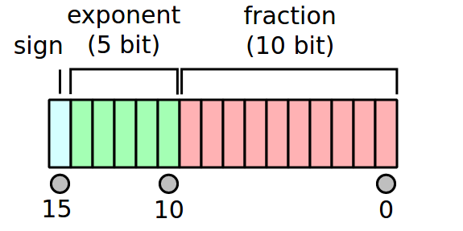

# **A High-Level Overview**

Deep Neural Networks (DNNs) have achieved breakthroughs in several areas, including Computer Vision, Natural Language Understanding, Speech Recognition tasks, and many others.  
  
Although increasing network size typically improves accuracy, the computational resources also increase (GPU utilization, Memory) so new techniques have been developed to train models faster without losing accuracy or modifying the network hyper-parameters by lowering the required memory will enable us to train larger models or train with larger mini-batches.  
  
In neural nets, all the computations are done in a **single precision floating point**.  
**Single precision floating point** arithmetic deals with 32-bit floating point numbers which means that all the floats in all the arrays that represent inputs, activations, weights .. etc are 32-bit floats (FP32).  
  
So an idea to reduce memory usage by dealing with 16-bits floats which called **Half precision floating point format** (FP16) But Half precision had some issues which localized in its small range and low precision, unlike single or double precision, floats, and for this reason, half precision sometimes won’t able to achieve the same accuracy.  
So with **Mixed precision** which uses both single and half precision representations will able to speed up training and achieving the same accuracy.  
<br>   

# **Problems In Half Precision**
<p>To understand the problems inhalf precision, let’s have a look what an FP16 looks like :</p>  

<p align="center">

</p>
<p align="center">
Fig. 1 : half precision floating point format.
</p>

**Divided Into three Modules**
1. The bit number 15 is the sign bit.
2. The bists for 10 to 14  are the exponent.
3. The final 10 bits are the fraction.


**The values for this representation is calculated as shown below** 

<p align="center">

</p>
<p align="center"> Fig. 2 : half precision floating point formatt with value for bits. </p>

1. If the exponent bits is ones (11111), then the value will be NaN ("Not a number").  
2. If the exponent bits is zeros (0000), then the value will be a subnormal number and calculated by :  
                    ```  (−1) ^ signbit × 2 ^  −14 × 0.0 + binary fraction series ```  
3. Otherwise the value will be a normalized value and calculated by :  
                    ```  (−1) ^ signbit × 2 ^ exponent value − 15 × 1.0 + binary fraction series ```  

> Based on half precision floating point methodology if we tried to add 1 + 0.0001 the output will be 1 because of the limited range and aligning between 1 and 0.0001 as shown in this [answer](https://cs.stackexchange.com/questions/63642/how-to-add-two-numbers-in-iee754-half-precision-format).  
><br>
> And that will cause numbers of problems while training DNNs, For trying and investigation through conversion or adding in binary 16 float point check this [site](http://weitz.de/ieee/).
<br>   
<br>
# **The main issues while training with FP16**
1. Values is imprecise.
2. Underflow Risk.
3. Exploding Risk.

### **Values is imprecise**
In neural Network training all weights, activations, and gradients are stored as FP16.  
And as we know updating weights is done based on this equation 
<p align="center">
**New_weight = Weight - Learning_Rate * Weight.Gradient**  
</p>
Since Weight.Gradient and Learning_Rate usually with small values and as shown before in half precision if the weight is 1 and Learning_Rate is 0.0001 or lower that will made freezing thrugh weights value.  

### **Underflow Risk**
In FP16, Gradients will get converted to zero because gradients usually are too low.   
In FP16 arithmetic the values smaller than 0.000000059605 = 2 ^ -24 become zero as this value is the smallest positive subnormal number and for more details investigate [here](https://en.wikipedia.org/wiki/Half-precision_floating-point_format).   
With underflow, network never learns anything.  

### **Overflow Risk**
In FP16, activations and network paramters can increase till hitting NANs.   
With overflow or exploding, network learns garbage.  
<br>

# **The Proposed Techniques for Training with Mixed Precision**
Mainly there are three techniques for preventing the loss of critical information.  
1. Single precision FP32 Master copy of weights and updates.  
2. Loss (Gredient) Scaling.  
3. Accumulating half precision products into single precision.  

### **Single precision FP32 Master copy of weights and updates**
To overcome the first problem we use a copy from the FP32 master of all weights and in each iteration apply the forward and backward propagation in FP16 and then update weights stored in the master copy as shown below.  

<p align="center">

</p>
<p align="center"> Fig. 3 : Mixed precision training iteration for a layer.   </p>
Through the storing an additional copy of weights increases the memory requirements but the overall memory consumptions is approximately halved the need by FP32 training.  

### **Loss (Gredient) Scaling**
* Gradient values with magnitudes below 2 ^ -27 were not relevant to training network, whereas it was important to preserve values in the [2 ^ -27, 2 ^ -24] range.  
* Most of the half precision range is not used by gradients, which tend to be small values with magnitudes below 1. Thus, we can multiply them by a scale factor S to keep relevant gradient values from becoming zeros.  
* This constant scaling factor is chosen empirically or, if gradient statistics are available, directly by choosing a factor so that its product with the maximum absolute gradient value is below 65,504 (the maximum value representable in FP16).  
* Of course, we don’t want those scaled gradients to be in the weight update, so after converting them into FP32,  we can divide them by this scale factor (once they have no risks of becoming 0).  


### **Accumulating half precision products into single precision**
After investigatin through last issue found that the neural network arithmetic operations falls into three groups vector dot-products , Reductions and point-wise operations.  
These categories benefit from different treatment when it comes to re-duced precision arithmetic.  
* Some networks require that the FP16 vector dot-product accumulates the partial products into an FP32 value, which is then converted to FP16 before storing.  
* Large reductions (sums across elements of a vector) should be carried out in FP32. Such reductionsmostly  come  up  in  batch-normalization  layers  when  accumulating  statistics  and  softmax  layers.  
* Point-wise  operations,  such  as  non-linearities  and  element-wise  matrix  products,  are  memory-bandwidth limited. Since arithmetic precision does not impact the speed of these operations, either FP16 or FP32 math can be used.  

<br>  

# **Mixed Precision Training Steps**
1. Maintain a master copy of weights in FP32.
2. Initialize S to a large value.
3. For each iteration:
    3.1 Make an FP16 copy of the weights.
    3.2 Forward propagation (FP16 weights and activations).
    3.3 Multiply the resulting loss with the scaling factor S.
    3.4 Backward propagation (FP16 weights, activations, and their gradients).
    3.5 If there is an Inf or NaN in weight gradients:
        3.5.1 Reduce S.
        3.5.2 Skip the weight update and move to the next iteration.
    3.6 Multiply the weight gradient with 1/S.
    3.7 Complete the weight update (including gradient clipping, etc.).
    3.8 If there hasn’t been an Inf or NaN in the last N iterations, increase S.
    
<br>  

# **Mixed Precision APIs**
* NVIDIA developed [Apex](https://github.com/NVIDIA/apex) as an extension for easy mixed precision and distributed training in Pytorch to enable researchers to  improve train their models.  
* But now a native automatic mixed precision supported in pytorch to avoid some point in Apex like   
1. Build extensions  
2. Windows not supported  
3. Don't guarantee Pytorch version compatibility  
4. Don't support forward/backward compatibilty  
5. Don't support Data Parallel and intra-process model parallelism   
5. flaky checkpointing  
6. Others    

# **Mixed Precision In Frameworks**
* **torch.cuda.amp** fixes all of these issues, the interface become more flexible and intuitive, and the tighter integration with pytorch brings more future optimizations into scope.    
* So No need now to compile Apex.  
* Tensorflow also supported mixed precision training and that a great [source](https://medium.com/tensorflow/automatic-mixed-precision-in-tensorflow-for-faster-ai-training-on-nvidia-gpus-6033234b2540) for investigation.  
<br>

# **Automatic Mixed Precision package - Pytorch**
* **[torch.cuda.amp](https://pytorch.org/docs/stable/amp.html)** provides convenience methods for running networks with mixed precision, where some operations use the torch.float32 (float) datatype and other operations use torch.float16 (half) as we have shown before.
* Till now Pytorch still developing an automatic mixed precision package but Gradient Scaling class is done and stable for usage.
* This Package mainly use **torch.cuda.amp.autocast and torch.cuda.amp.GradScaler** modules together.
* **[torch.cuda.amp.GradScaler](https://pytorch.org/docs/stable/notes/amp_examples.html#gradient-scaling)** is not a complete implementation of automatic mixed precision but useful when you manually run regions of your model in float16.
* If you aren’t sure how to choose operation precision manually  so you have to use **[torch.cuda.amp.autocast](https://pytorch.org/docs/master/amp.html#autocasting)** which serves as context managers or decorators that allow regions of your script to run in mixed precision `NOT Stable Yet`.
> Note :
If you trained your model on FP32 and while testing called model.half(), Pytorch will convert all the model weights to half precision and then forward with that.


# **References**
* [Mixed Precision Training Paper](https://arxiv.org/pdf/1710.03740.pdf).
* [Training Mixed Precision User Guide](https://docs.nvidia.com/deeplearning/performance/pdf/Training-Mixed-Precision-User-Guide.pdf).
* [Introduction For Mixed Precision Training By Fastai](https://forums.fast.ai/t/mixed-precision-training/20720).
* [https://docs.nvidia.com/deeplearning/performance/mixed-precision-training/index.html#introduction](https://devblogs.nvidia.com/apex-pytorch-easy-mixed-precision-training/).
* [Automatic Mixed Precision in TensorFlow](https://medium.com/tensorflow/automatic-mixed-precision-in-tensorflow-for-faster-ai-training-on-nvidia-gpus-6033234b2540).
* [Automatic Mixed Precision Package In Pytorch](https://pytorch.org/docs/master/notes/amp_examples.html#amp-examples).


