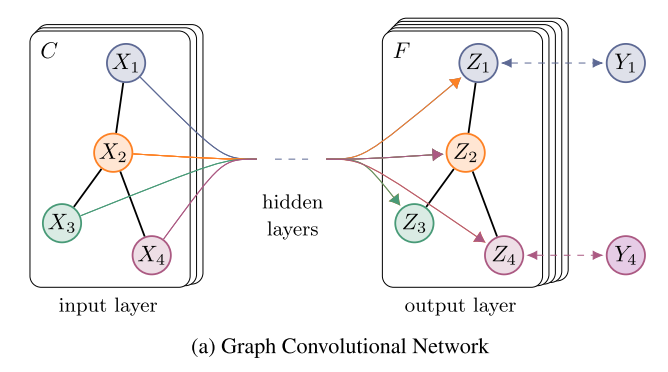
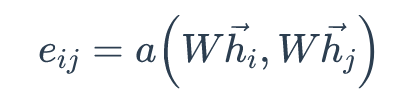
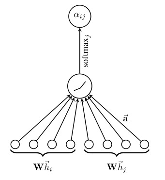
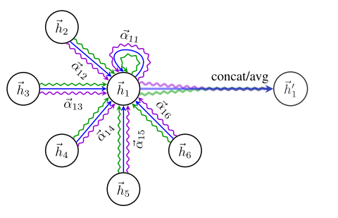
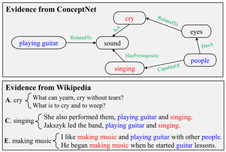

 

## **Task introduction**

### **Task overview**
Using CSQA (Common Sense Questions and Answers) dataset.
For questions that do not mention background knowledge, it is required to consider background knowledge and answer. 

### **Task form**

Input: Question Q=q_1 q_2...q_m and candidate answer set A={a_1,a_2,...,a_n} containing n answers.  
Goal: select the correct answer from the candidate set.  
Evaluation : accuracy.  

### **The problem we are facing**

 1. How to obtain evidence information in the background knowledge related to the problem (extract triples and construct a graph for the knowledge source).
    
 2. How to make predictions based on the obtained evidence information (the graph represents learning + graph reasoning to solve) 

    

## **solution**

Fig. 1 : knowledge extraction and graph-based reasoning

### **Extract evidence from external knowledge base**
### **Method**

 1. Manual labeling-time-consuming, labor-intensive and costly.

 2. Only extract evidence from (structured/unstructured) knowledge sources-without using knowledge from different sources at the same time, the obtained evidence may not be comprehensive.

 3. Fusion of knowledge in structured and unstructured knowledge bases, such as the fusion of structured ConceptNet library and plain text Wikipedia library, and extract evidence from it

## **Specific implementation**

### **Extract from ConceptNet**

 1. Identify entities that appear in different problems and options in ConceptNet.

 2. Extract the path from the entity in the question to the entity in the candidate from ConceptNet (less than 3 hops)

### **Extract from Wikipedia**

 1. Use Spacy to extract 107M sentences from them, and use Elastic Search tools to build a sentence index.

 2. For each training example, remove the stop words in the question sentence and the candidate, and then concatenate all the words as a search query.

 3. Use the Elastic search engine to sort between the search query and all sentences, and select top-K sentences as the evidence information provided by Wikipedia (in the experiment, K=10).

## **Build a graph for each source of knowledge**
### **Method**

 1. For the ConceptNet library, use its own triples

 2. For the Wikipedia library, extract the triples in the sentence through the semantic role labeling (SRL).

## **Specific implementation**

### **Build a ConceptNet graph**

 1. Split the path extracted from ConceptNet into triples, treat each triple as a node and merge it into the graph. for triples containing the same entity, add the corresponding nodes in the graph Previous side

 2. In order to obtain the context word representation of the node in ConceptNet, the triplet is converted into a natural language sentence according to the relational template.

### **Build a Wikipedia diagram**

 1. Use SRL to extract the arguments of each predicate in the sentence, with the predicate and the argument as nodes, and the relationship between them as edges

 2. Similarly, in order to enhance the connectivity of the constructed graph, the edges between nodes a and b are added based on two given rules:  

        1. b contains a and the number of words in a is greater than 3. 
        2. a and b have only one different word, and both a and b contain more than 3 words.  

## **Coding map information, gathering evidence information**

Fig. 2 : overview of our proposed graph-based reasoning model

### **Specific implementation**

 1.1 Use the Topology Sort algorithm to rearrange the order of the evidence sentences according to the graph structure obtained from the knowledge extraction part.  
 1.2 Use the structure of the obtained graph to redefine the relative position between the evidence words to make the relative positions of semantically related words closer.  
 1.3 Use the relational structure within the evidence to obtain a better contextual representation.

 2.1 Arranged the evidence sentences, questions, and all options extracted from the ConceptNet library and Wikipedia library.  
 2.2 The concatenation of the above 4 parts is encoded as the input of XLNet after using [sep] for separation

## **Make the final prediction**
### **Specific implementation**

 1. Regarding the two evidence graphs as an undirected graph, use the word-level vector representation of question and answer + evidence provided by GCN on the knowledge graph and XLNet coding to encode to obtain the node-level representation.

 2. Evidence spread:  
        1. Gather information from neighbor nodes.  
        2. Combine and update node representation.

 3. Use the graph attention network to process the node representation obtained by GCN and the input representation of XLNet, gather the graph-level representation, and then perform the final prediction score.

## **Explanation of key modules and methods**
### **SRL**

- Semantic Role Labeling (SRL) is centered on the predicate of the sentence, and does not analyze the semantic information contained in the sentence in depth. It only analyzes the relationship between each component in the sentence and the predicate, that is, the predicate of the sentence. Element (Argument) structure. Using semantic roles to describe these structural relationships is an important intermediate step in many natural language understanding tasks (such as information extraction, text analysis, in-depth question and answer, etc.). In research, it is generally assumed that the predicate is given, and what we have to do is to find out the various arguments of the given predicate and their semantic roles. 

### **ConceptNet**

ConceptNet: Common sense knowledge base, which is composed of relational knowledge in the form of triples. 

### **ElaticSearch**

ElasticSearch: A Lucene-based search server. It provides a full-text search engine with distributed multi-user capabilities and is currently a popular enterprise-level search engine. 

### **Topology Sort**

Fig.3 : topology sort algorithm

### **Process ConceptNet**
Convert triples into natural sentences, for example, (mammals, HasA, hair) -> mammals has hair

### **Processing Wikipedia**
- Use the evidence sentence as the node in the sentence graph to construct the sentence graph. If in the process of constructing the wikipedia graph, the nodes p and q are in the sentence s and t respectively, then add a node for the two corresponding sentences in the sentence graph side.
- The topological sorting algorithm is used to sort the nodes in these constructed sentence graphs. 

### **XLNET**

### **The reasons for using XLNet instead of BERT are summarized as follows:**

- The inconsistency between BERT training data and test data is also called Discrephancy. When we train BERT, Will randomly mask some words, but in the process of using, we don’t have labels like MASK. So this problem causes the training process and the use (testing) process to be different. This is a major problem.

- BERT cannot be used to generate data. Since BERT itself is trained on the structure of DAE, it is not like those models trained based on language models that have good generation capabilities.
The previous methods such as NNLM and ELMo are generated based on language models, so some sentences, texts, etc. can be generated with the trained model.
But the methodology based on this kind of generative model itself has some problems, because when understanding the meaning of a word in the context, the language model only considers its upper part, not the following!

Based on these shortcomings of BERT, scholars proposed XLNet, and also borrowed from the language model, as well as the advantages and disadvantages of BERT. The specific approach is as follows:
- First of all, the generative model is one-way. Even if we use the Bidirectional LSTM model, in fact, two sets of one-way models are used.
By using the permutation language model, all possible permutations are taken into consideration.
- In addition, in order to cater to this change, they have made improvements to the original Transformer Encoder architecture and introduced a dual-stream attention mechanism.
And in order to better handle longer texts, Transformer-XL is used.

### **GCN**

- The graph convolutional neural network, in fact, has the same function as CNN, which is a feature extractor, except that its object is graph data (the structure is very irregular, and the data does not have translation invariance, which makes it suitable for processing pictures and languages. The traditional CNN and RNN that resemble Euclidean spatial data fail instantaneously). 

- GCN has delicately designed a method of extracting features from graph data, so that we can use these features to perform node classification, graph classification, link prediction, and link prediction on graph data. You can get the graph embedding by the way. 

- The process of encoding the evidence map in Step 4 is actually equivalent to extracting the features of the map data.

- GCN is also a neural network layer, and the propagation mode between layers is as follows (using the Laplacian matrix).

Fig.4 : GCN

### **GAT**

- Like all attention mechanisms, the calculation of GAT is divided into two steps: Calculate the attention coefficient. for vertex i, pay attention to calculating the similarity coefficient between it and its adjacent nodes.

- The linear mapping of the shared parameter W enhances the feature of the vertex, a(·) maps the spliced high-dimensional feature to a real number. This process is generally implemented by a single-layer feedforward neural network. The correlation coefficient The attention coefficient is obtained by normalization with softmax. To understand the calculation process, see the figure below. 

Weighted summation. Perform weighted summation of the calculated attention coefficients, plus the multi-head mechanism for enhancement 

    

### **Similarities and differences between GCN and GAT**  

- Same: Both GCN and GAT aggregate the features of neighbor vertices to the central vertex (an aggregate operation), and learn new vertex feature expressions by using local stationarity on the graph.  
- Difference: GCN uses the Laplacian matrix, and GAT uses the attention coefficient.  
    

### **Why integrate heterogeneous knowledge sources?**    

- Structured knowledge (Structured Knowledge Source): Contains a large amount of triplet information (concepts and their relationships), which is conducive to reasoning, but there is a problem of low coverage.  
- Unstructured Knowledge (Unstructured Knowledge Source): Plain-Text, which contains a large amount of redundant and wide-covered information, which can assist/supplement structured knowledge.  

