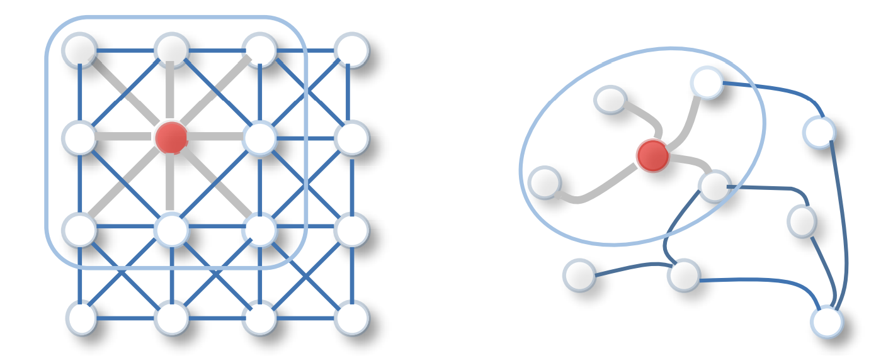
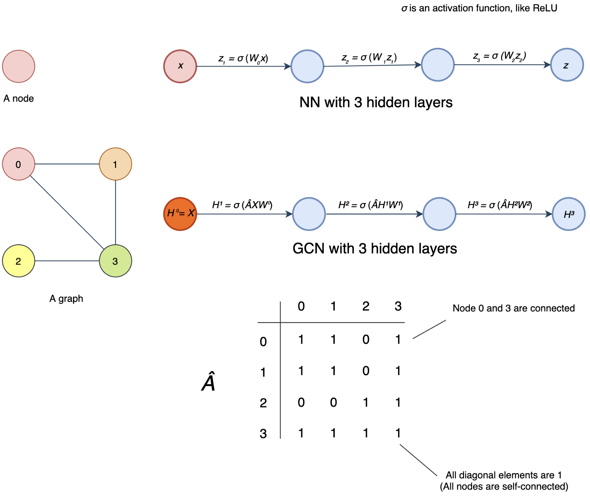

 

## Graph Convolutional Networks (GCN)

The general idea of GCN is to apply convolution over a graph. Instead of having a 2-D array as input, GCN takes a graph as an input.

## Why Graphs?

- Many problems are graphs in true nature. In our world, we see many data are graphs, such as molecules, social networks, and paper citations networks.

## Tasks on Graphs

- Node classification: Predict a type of node
- Link prediction: Predict whether two nodes are linked
- Community detection: Identify densely linked clusters of nodes
- Network similarity: How similar are two (sub) networks

## Graphs 

- A graph (directed or undirected) consists of a set of nodes and a set of edges E.
- Nodes	are	represented	by attribute values	(can be	scalar or vector) (the data of nodes)
- Edges	can	be weighted	(weights can be	scalar or vector) or binary (structure of the graph).

## GCN
- GCNs can be categorized into 2 major algorithms, Spatial Graph Convolutional Networks and Spectral Graph Convolutional Networks. 
- we will focus on Fast Spectral Graph Convolutional Networks.

## Idea
- The original idea behind Spectral GCN was inspired by signal/wave propagation.
- We can think of information propagation in Spectral GCN as signal propagation along the nodes.
- Spectral GCNs make use of the Eigen-decomposition of graph Laplacian matrix to implement this method of information propagation.
- To put it simply, the Eigen-decomposition helps us understand the graph structure, hence, classifying the nodes of the graphs.
- This is somewhat similar to the basic concept of Principal Component Analysis (PCA) and Linear Discriminant Analysis (LDA) where we use Eigen-decomposition to reduce dimensionality and perform clustering.
- In this approach, we will take into account the Adjacency Matrix (A) in the forward propagation equation in addition to the node features (or so-called input features).
-  A is a matrix that represents the edges or connection between the nodes in the forward propagation equation. 
- The insertion of A in the forward pass equation enables the model to learn the feature representations based on nodes connectivity. 

## Graphs Training
- The first diagram (the first row) below is the NN as we know and the second diagram is the GCN with a graph containing four nodes as the input.

- In the first NN, it contains multiple dense layers (fully connected layers).
- x is the input for the first layer and zᵢ is the output of layer i.
- For each layer, we multiple z (or x for the first layer) with the weight matrix W and pass the output to an activation function σ, say ReLU. 

 

- GCN is very similar, but the input to σ is ÂHⁱWⁱ instead of Wᵢzᵢ. 
- i.e. σ(Wᵢzᵢ) v.s. σ(ÂHⁱWⁱ) where zᵢ and Hⁱ are the output vectors from the last hidden layer for NN and GCN respectively.
- But please note that Wⁱ and Wᵢ are different and have different dimensions. And for the first layer in GCN, X contains an array of nodes instead of a single node x. X will be encoded as a matrix with each row contains the features of a node.

 

- So what is Â? GCN introduces an adjacency matrix A as shown before.
- The element Aᵢⱼ in A equals 1 if node i and j are connected. Otherwise, it will be zero. So  indicates the neighbors of a node. 
- But we will make one more adjustment to indicate all nodes are self-connected. 
- This indicates the output of a node in a hidden layer depends on itself and its neighbors. 
- So, we convert all diagonal elements of A to 1 to form Â. Mathematically, Â equals A + I.

- That comes to the output of the hidden layer to be σ(ÂHⁱWⁱ). 
- If we ignore W for a second, for each node in a hidden layer, ÂHⁱ sums up features on each node with its neighbors.

 

- However, we may face the vanishing or exploding problem in a NN if we don’t have certain control over the range of the hidden layer output. 
- In specific, GCN wants  to be normalized to maintain the scale of the output feature vectors. 
- One possibility is to multiple  with D̂⁻¹ where D̂ is the diagonal node degree matrix of  in measuring the degree of each node.
- At a high level, instead of summing up itself with its neighbor, multiplying the sum with the inverse D̂⁻¹ sort of averages them. 
- Specifically, D̂ is a diagonal matrix with each diagonal element D̂ᵢᵢ counts the number of edges for the corresponding node i. And the output for each hidden layer becomes σ(D̂⁻¹ÂHⁱWⁱ), instead of σ(ÂHⁱWⁱ).

 

- Let’s calculate D̂ in our example. For an undirected graph, the degree of a node is counted as the number of times an edge terminates at that node. So a self-loop will count twice. 
- In our example, node 0 has 2 edges connecting to its neighbors plus a self-loop. Its degree equals 4 (i.e. 2 + 2). For node 3, its degree equals 5 (3 + 2).

And D̂⁻¹ equals

- The diagram below summarizes the model discussed so far. In this example, it has 3 hidden layers and for each hidden layer, it computes its output as σ(D̂⁻¹ÂHⁱWⁱ). 

- In the main paper, Kipf and Welling states that doing symmetric normalization will make dynamics more interesting, hence, the normalization equation is modified from:

## Refrences
- https://towardsdatascience.com/understanding-graph-convolutional-networks-for-node-classification-a2bfdb7aba7b (awesome for implemntaion details)
- https://towardsdatascience.com/graph-convolutional-networks-on-node-classification-2b6bbec1d042 (awesome for implemntaion details)
- https://jonathan-hui.medium.com/graph-convolutional-networks-gcn-pooling-839184205692 (show more details for spatial and spectral GCN and different stuff).
